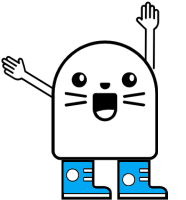

# @exadel/server-sketch-cli




## Overview
Simple command line interface(CLI) to work with [@exadel/server-sketch](https://www.npmjs.com/package/@exadel/server-sketch) ([git](https://github.com/exadel-inc/server-sketch)). Helps create & setup demo project. 


## How to use
### Install
1) Install **[NodeJs](https://nodejs.org/en/)** (This will also install **npm**)
2) Create simple *package.json* (`` npm init ``)
3) Install `` @exadel/server-sketch `` as dependency for your project (👍):
```shell script
npm i @exadel/server-sketch --save-dev
```
4) And CLI `` @exadel/server-sketch-cli ``:
```shell script
npm i @exadel/server-sketch-cli
```

 
### Quick Start
1) Create demo project(structure):
```shell script
npx server-sketch create-demo-project 
```

2) Start server:
```shell script
npm run server
```

3) Easiest! You can make a ☕ :) 

### Commands
- ``npx server-sketch create-demo-project``: Create demo project with initial structure.

### FAQ
Will be updated. If you have any questions, you can ask with "Issues" (❓).

### Links 
- [@exadel/server-sketch](https://www.npmjs.com/package/@exadel/server-sketch) | [git](https://github.com/exadel-inc/server-sketch)
- [@exadel/server-sketch-cli](https://www.npmjs.com/package/@exadel/server-sketch-cli) | [git](https://github.com/exadel-inc/server-sketch-cli)
- [Exadel Inc. Github](https://github.com/exadel-inc/)

🧰 

---
**Exadel, Inc.**

[](https://exadel.com)
